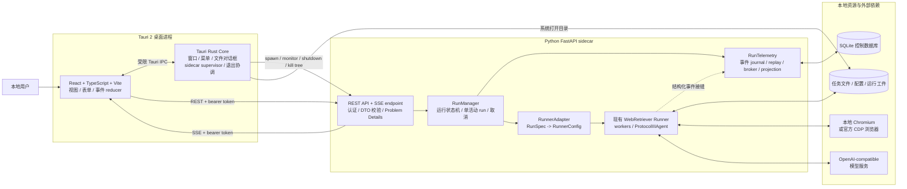
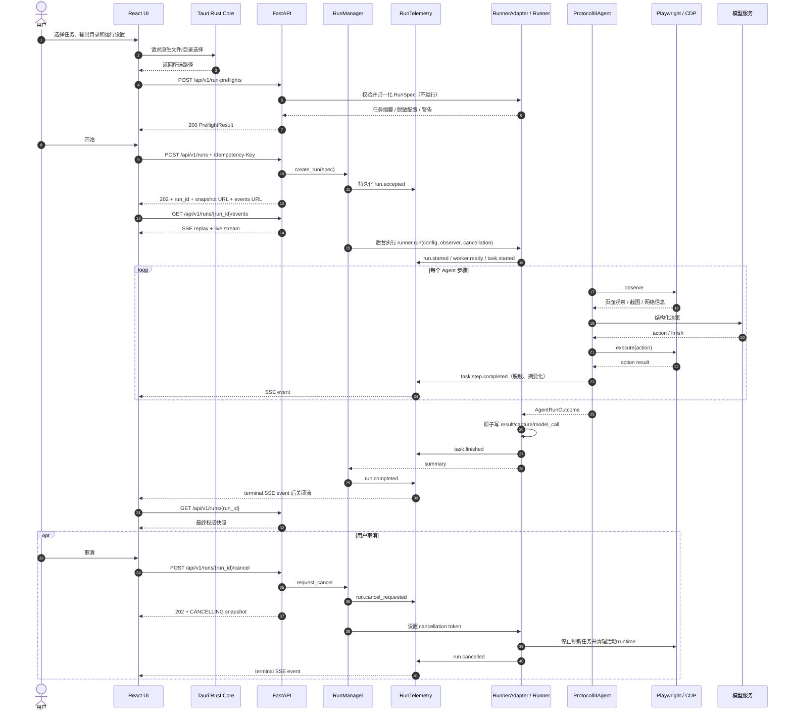

# WebRetriever 本地桌面 GUI 设计

- 状态：提案（不包含实现）
- 日期：2026-09-03
- 目标：Tauri 2 + React/TypeScript/Vite 桌面端，配套 Python FastAPI sidecar；REST 下发控制命令，SSE 推送运行事件
- 首版平台基线：Linux 桌面

## 1. 结论与设计原则

建议保留现有 WebRetriever Runner 作为唯一执行内核，在它外面增加一个薄的 `RunnerAdapter`、进程内 `RunManager` 和 `RunTelemetry`，再由 FastAPI 暴露本地控制面。Tauri Rust 核心只负责原生桌面能力和 sidecar 生命周期，不参与 Agent 的任务调度；React 只负责显示和用户交互，不成为运行状态的权威来源。

MVP 支持“一个活动 run（一个批次）”，但这个 run 仍可使用现有 Runner 在批次内并发执行多个任务，最多 8 个 worker。这里的单 run 限制不是把 Runner 降成单题，而是避免首版同时启动多个互相竞争浏览器、模型配额和输出目录的独立批次。

关键原则如下：

1. 不替换、不绕过现有 `RunnerConfig -> runner.run() -> ProtocolIIIAgent.run()` 链路。
2. 保持比赛入口和工件格式不变；GUI 是新增的本地控制面，不改变 `scripts/run.sh` 的位置参数契约。
3. `run_id` 是桌面控制面的运行标识，`task_id` 仍是比赛任务标识，两者不得混用。
4. 控制命令走 REST，运行期事件走 SSE；最终事实以 sidecar 的运行快照和落盘工件为准。
5. 取消必须是显式、可观测的状态迁移，不把“断开 SSE”解释成取消，也不靠杀进程实现常规取消。
6. sidecar 仅监听回环地址，使用每次启动随机生成的 bearer token；密钥、CDP token 和原始模型提示不得进入事件流。
7. 实时观测通过 Runner/Agent 的可选事件接缝实现，不通过轮询日志、抓取 stdout 或反复读取 `result.json` 猜测状态。

## 2. 仓库现状与约束

### 2.1 实际入口与调用链

当前正式入口是：

```text
scripts/run.sh
  -> python3 -m browser_use.webretriever.submission
  -> build_submission_config()
  -> runner.run(RunnerConfig)
  -> _cdp_worker() / _local_worker()
  -> _run_task()
  -> ProtocolIIIAgent.run()
  -> BrowserRuntime + 模型服务
```

证据与含义：

| 位置 | 当前行为 | 对 GUI 设计的影响 |
| --- | --- | --- |
| [`scripts/run.sh`](scripts/run.sh) | 固定接受任务文件、输出目录和至少一个 CDP URL，设置 `PYTHONPATH` 后进入 submission adapter | 必须原样保留为正式评测入口；GUI 不应调用或改写该接口 |
| [`src/browser_use/webretriever/submission.py`](src/browser_use/webretriever/submission.py) | 从根目录 `config.json` 读取模型配置，固定 Playwright、100 步、180 秒模型超时、最多 8 个 CDP worker，单题超时 9000 秒 | 正式模式参数应由既有 adapter 约束；GUI 的开发模式可使用 RunnerConfig 的受支持子集 |
| [`src/browser_use/webretriever/cli.py`](src/browser_use/webretriever/cli.py) | 本地开发 CLI；支持 TOML、环境变量、任务筛选、本地浏览器/CDP、headed/headless、实验开关和 `validate-only` | GUI 配置表单可参考这里，但不应调用 argparse，也不应暴露实验开关作为 MVP 主流程 |
| [`src/browser_use/webretriever/runner.py`](src/browser_use/webretriever/runner.py) | 校验配置、加载任务、创建最多 8 个异步 worker、管理 CDP 会话、执行 Agent、写汇总 | `RunnerAdapter` 应直接构造 `RunnerConfig` 并调用 `run()` |
| [`src/browser_use/webretriever/agent.py`](src/browser_use/webretriever/agent.py) | 单步观察、模型决策、浏览器动作、恢复、完成判定；步骤信息先保存在 `AgentRunOutcome` 内存中 | 需要在稳定边界增加可选 telemetry/cancellation 接口，才能实时推送且正确取消 |
| [`src/browser_use/webretriever/artifacts.py`](src/browser_use/webretriever/artifacts.py) | 原子写 JSON、按任务加锁、写 `result.json`、`capture.json`、轨迹和模型调用记录 | GUI 必须复用这些工件，不维护第二套任务结果 |
| [`src/agent/main.py`](src/agent/main.py) | 旧模板多进程入口 | 当前 `scripts/run.sh` 已不再调用；不应作为 GUI 的执行内核 |
| [`src/agent/web_controller.py`](src/agent/web_controller.py) | 仍被 submission adapter 用于官方 CDP token/header 兼容 | 不能因为旧入口不再使用就删除或绕过 |

本地核验已确认 `python -m browser_use.webretriever --validate-only` 能读取示例任务，并且只向 Agent 暴露 `task_idx`、`task_id`、`website`、`task` 四个安全字段。`CompetitionTask` 同时校验 URL 和路径安全的 `task_id`。

### 2.2 当前配置来源

现在存在两条配置路径：

- 正式 submission：根目录 [`config.json`](config.json)，支持 `api_model`、`api_mode`、`reasoning_effort` 和一个或多个 `model_services`；兼容旧的单服务 `api_base` / `api_key`。
- 本地 CLI：可选 `[webretriever]` TOML、环境变量和命令行覆盖，最终归一化为 `RunnerConfig`。

GUI 不应直接把 `RunnerConfig` 暴露为 HTTP 模型，因为其中包含 `Path`、枚举、回调和模型凭据。sidecar 应定义独立的 `RunSpec`，再由 `RunnerAdapter` 完成白名单映射和二次校验。

当前 `config.json` 含明文 API key，本文不复述。MVP 可以为了兼容而让 sidecar 在服务端读取该文件，但不得把 key 返回 React、写入控制数据库、SSE 或日志，也不得把这个文件原样打包进发布版。发布版需要迁移到操作系统凭据存储或 Tauri Stronghold；仓库中的现有凭据也应按团队的密钥管理流程处理。

### 2.3 运行模式和硬约束

- 批次任务输入支持 JSON 数组、JSONL、单对象，以及带顶层 `tasks` 数组的对象。
- 比赛最多 8 个 CDP URL；Runner `max_concurrency` 范围为 1–8。
- 每题 `max_steps` 范围为 1–100。
- 单次模型调用超时范围为 `(0, 180]` 秒。
- 本地浏览器与 CDP 模式互斥。
- 正式 CDP 模式禁止 `rerun_failed`。
- 同一个模型服务路由器在一个 run 内由所有 worker 共享；本地 VLM 端口仍按 worker 分配。
- SEC 任务在 Runner 内被串行化，并支持声明带联系方式的 User-Agent。
- 已有 `SUCCESS` 任务会跳过；失败任务是否重跑受开发模式和 `rerun_failed` 控制。
- 工件目录仍是 `{run_output_dir}/{task_idx}_{task_id}/`，并带 `logs/summary.json`。

比赛官方指南确认正式环境通过 CDP 提供云端浏览器，所有浏览器操作必须经 Playwright；Protocol III 要求同时完成导航和最终信息提取。GUI 不能引入“直接 HTTP 抓目标网站”之类的旁路执行器。[WebRetriever Challenge Guide](https://mininglamp-ai.github.io/WebRetriever_Challenge/guide/)

### 2.4 依赖与平台现状

[`environment.yml`](environment.yml) 声明 Python 3.11、Pydantic 2、Playwright 1.61、模型 SDK、数据分析和文档处理依赖，但尚未声明 FastAPI、Uvicorn 或 SSE 库。按仓库约束检查的本机 `Browser-Use` conda 环境为 Python 3.12.13；其中 FastAPI 未安装，Uvicorn 和 `sse-starlette` 虽存在，但属于未声明环境状态，不能作为可复现构建依据。

此外，`TaskLock` 当前依赖 Unix `fcntl`，在 Windows 会直接不可用。因此：

- MVP 以 Linux 桌面为受支持基线。
- macOS 大概率可运行，但仍需完成打包、签名、浏览器和菜单行为验证。
- Windows 必须先引入跨平台文件锁并完成 Playwright/子进程树测试，不能只增加一个 Tauri target 就宣称支持。

## 3. 需求与假设

### 3.1 功能需求

| 编号 | 需求 | MVP |
| --- | --- | --- |
| F1 | 启动桌面应用时启动唯一 sidecar，展示“启动中 / 就绪 / 故障 / 正在关闭”状态 | 是 |
| F2 | 通过系统文件选择器选择任务 JSON/JSONL、模型配置文件和输出根目录 | 是 |
| F3 | 配置本地 Playwright 浏览器或一个/多个 CDP URL；设置 headed、并发数、任务筛选、步数和超时 | 是 |
| F4 | 运行前校验文件格式、Runner 约束、输出目录、浏览器模式和模型配置，但不启动任务 | 是 |
| F5 | 创建 run 后立即返回 `run_id`，异步执行，不让 HTTP 请求持续到任务结束 | 是 |
| F6 | 实时展示 run、worker、task、step、模型等待、浏览器动作、恢复、错误和完成事件 | 是 |
| F7 | 网络短暂中断或 WebView 刷新后，从最后事件继续，不丢失最终状态 | 是 |
| F8 | 支持幂等的 run 级优雅取消；显示 `CANCELLING`，完成资源清理后进入 `CANCELLED` | 是 |
| F9 | 展示最终批次汇总、每题既有终态、错误分类和工件索引；可用系统应用打开输出目录 | 是 |
| F10 | 应用退出时停止接收新任务、取消活动 run、冲刷 telemetry、关闭浏览器连接并回收 sidecar 进程树 | 是 |
| F11 | 保留最近运行历史，并在 sidecar 崩溃重启后把未终结 run 标记为 `INTERRUPTED` | 是 |
| F12 | 同时执行多个独立 run、暂停/恢复单题、自动重放中断任务 | 否 |
| F13 | 远程执行、多用户登录、任务上传、团队共享与云端工件 | 否 |

应用菜单建议最少包含：

- 文件：选择任务文件、选择输出目录、打开输出目录、退出。
- 运行：预检、开始、取消；状态不允许时禁用菜单项。
- 视图：重新加载 UI；开发构建才允许打开开发者工具。
- 帮助：版本、sidecar/协议版本和诊断信息。

MVP 不提供托盘后台运行。用户选择退出或平台语义上的最后窗口退出时，必须进入相同的优雅关闭流程；不能留下不可见 Agent。

### 3.2 非功能需求

| 维度 | 目标 |
| --- | --- |
| 正确性 | GUI 执行结果与直接调用现有 Runner 一致；不改变比赛 `result.json`、`capture.json` 和目录契约 |
| 启动 | 已打包、正常机器上 sidecar 目标 10 秒内就绪；超过 15 秒视为一次启动失败并进入受控重试 |
| 响应 | REST 控制请求本地 p95 小于 200 ms；普通运行事件从产生到 UI 可见目标 p95 小于 500 ms |
| 规模 | 一个活动 run，最多 100 个任务、8 个 worker；事件设计按数万条/run 有界处理 |
| 可靠性 | run 状态和事件序号持久化；进程崩溃不把未完成任务误报为完成；工件继续使用原子写 |
| 取消 | 取消请求 200 ms 内确认接收；清理是有界等待，超时后允许用户强制终止整个 sidecar 进程树 |
| 安全 | 仅绑定 `127.0.0.1`，每次启动随机认证，严格 CORS/CSP，最小 Tauri capabilities，无明文密钥/令牌遥测 |
| 可维护性 | FastAPI、Tauri 和 Runner 通过显式 DTO/Protocol 解耦；HTTP 代码不进入 Agent 核心 |
| 可测试性 | 状态机、API、SSE 重连、取消、sidecar 崩溃和 Runner adapter 可在不访问真实网站时测试 |
| 可观测性 | 每个请求有 `trace_id`，每个事件有单 run 单调序号；日志、事件和工件可用 `run_id/task_id` 关联 |

### 3.3 合理假设

1. 这是单机、单用户、受信任的本地调试工具，而不是本地多租户服务。
2. Tauri 使用 single-instance 约束；一个桌面实例只拥有一个 sidecar。
3. 一次 run 可含多个比赛任务，但 MVP 同时只允许一个活动 run。
4. 输入、配置和输出均是 sidecar 可访问的本地路径；默认每次 run 创建新的输出子目录，避免命中旧结果的跳过语义。
5. 本地浏览器和模型服务需要外部网络；GUI 不承诺离线完成网页任务。
6. 常规取消可以停止后续动作，但无法撤销已经在真实网站上产生的副作用；因此不提供自动重放或“恰好一次”承诺。
7. 正式比赛仍从 `scripts/run.sh` 启动，不依赖桌面应用、FastAPI 或控制数据库。
8. 首版配置兼容现有文件，凭据存储升级属于发布前安全门槛，而不是远期可选优化。

## 4. 总体架构

### 4.1 组件图



这里有两条不同信道：

- Tauri IPC：仅承载原生桌面操作、sidecar bootstrap descriptor 和 sidecar 进程状态。
- REST/SSE：承载所有 run 级业务命令、快照和执行事件。

sidecar 已崩溃时不可能再发 SSE，因此 Tauri 必须通过一个很小的 `backend-state-changed` IPC 事件告诉 React“进程已退出/正在重启”。这不是第二套 run 协议；sidecar 重启后，React仍通过 REST 取得权威 run 快照，并通过 SSE 接收 `run.interrupted`。

### 4.2 一次任务执行时序图



## 5. 职责边界

### 5.1 Tauri Rust Core

负责：

- 创建系统窗口、原生应用菜单、文件/目录选择器、打开输出目录和 single-instance 行为。
- 在 Rust 侧启动固定名称的 sidecar，保留 child handle，读取结构化启动握手，监控退出状态。
- 生成每次 sidecar 启动的随机 token 与 nonce，通过环境变量和受控 IPC 传递。
- 管理 sidecar 启动重试、优雅关闭、超时强杀和进程树回收。
- 将 `{base_url, bearer_token, protocol_version}` 仅保存在内存中，并通过受限 Tauri command 提供给主窗口。
- sidecar 不可用时向 UI 发出进程级状态事件。

不负责：

- 构造 `RunnerConfig`、加载任务、调度 worker、解释 Agent 状态或读取 `result.json` 生成业务状态。
- 代理模型请求、浏览器请求或 SSE 事件。
- 向 React 暴露通用 shell/任意进程执行能力。

Tauri 官方支持把任意语言的可执行文件作为 `externalBin` sidecar 并通过 shell plugin `spawn`；权限应限定到固定 sidecar 和固定参数，不允许任意命令。[Tauri sidecar](https://v2.tauri.app/develop/sidecar/) [Tauri capabilities](https://v2.tauri.app/reference/acl/capability/)

### 5.2 React + TypeScript + Vite

负责：

- 表单、预检结果、运行进度、任务列表、错误和工件导航等用户体验。
- 调用 Tauri 的受限原生能力；获取 sidecar descriptor 后直接调用 REST/SSE。
- 维护纯展示投影：先加载 `RunSnapshot`，再按 `event_id` 幂等归并事件。
- SSE 断线重连、指数退避、页面刷新后的快照重建。
- 根据服务端状态禁用非法操作；但不能只靠按钮禁用保障状态机。

不负责：

- 保存 API key、CDP token 或 bearer token 到 localStorage/IndexedDB。
- 自行判断 run 已完成、自行生成 task 终态，或把 SSE 断线解释为任务失败。
- 直接访问任意本地文件、启动 Python、杀进程、拼接 shell 命令。

原生文件/目录选择使用 Tauri dialog；官方 API 在桌面端返回系统路径。文件权限只给主窗口需要的最小 capability。[Tauri dialog](https://v2.tauri.app/plugin/dialog/) 原生菜单在 Rust 侧创建，菜单事件转换为受限 UI 事件或 Rust command。[Tauri window menu](https://v2.tauri.app/learn/window-menu/)

### 5.3 FastAPI sidecar

负责：

- 本地 HTTP 认证、CORS、请求/响应 DTO、OpenAPI、REST 和 SSE。
- 运行前校验、`RunManager` 生命周期、`RunTelemetry`、控制数据库和工件安全索引。
- 将 API 的 `RunSpec` 映射为现有 `RunnerConfig`，调用现有 Runner。
- 统一脱敏、错误分类、run 快照和事件重放。
- 接收优雅 shutdown 请求，停止接收新 run，协调取消并冲刷状态。

不负责：

- 创建系统窗口、文件对话框、应用菜单或持有桌面应用退出语义。
- 自行重启自己或成为守护进程。
- 复制 Agent 算法、另写浏览器调度器，或更改比赛 submission 入口。

### 5.4 Runner/Agent 内核

负责既有领域逻辑：任务加载、浏览器会话、模型路由、任务预算、取证、恢复、结果和比赛工件。为了 GUI，需要增加两个与框架无关的可选接缝：

- `RunObserver`：接收结构化生命周期/步骤事件；默认是 no-op，正式 submission 不启用时行为不变。
- `CancellationToken`：在领取任务、观察、模型调用、动作执行和恢复边界检查；默认永不取消。

这些接缝不得导入 FastAPI、SSE、SQLite 或 Tauri 类型。`RunTelemetry` 是 observer 的一个实现，`RunManager` 持有 cancellation token。仅轮询现有日志会丢失准确的动作边界和取消因果，不作为可接受方案。

## 6. Sidecar 生命周期

### 6.1 启动与动态端口发现

采用“sidecar 自己绑定端口 0 + stdout 单行握手”，避免由 Tauri 先找空闲端口再释放所产生的 TOCTOU 端口抢占窗口。

1. Tauri setup 阶段生成 256-bit 随机 bearer token、128-bit launch nonce，并取得应用私有 `state_dir`。
2. Rust 侧以固定 external binary 名称启动 sidecar；只通过环境变量传入 token、nonce、state_dir、父进程标识和允许的 WebView origins。不要把 token 放在命令行参数中。
3. Python 在 `127.0.0.1:0` 上预绑定 socket，取得实际端口，再把该 socket交给 Uvicorn；不监听 `0.0.0.0` 或局域网地址。
4. socket 已绑定后，sidecar 向 stdout 写一条带固定前缀、立即 flush 的 JSON：

   ```text
   WR_SIDECAR_LISTENING {"protocol_version":1,"port":43127,"pid":12345,"launch_nonce":"..."}
   ```

5. Tauri 只解析固定前缀，校验端口范围、pid、nonce 和协议主版本；普通 stdout/stderr 只能进入脱敏诊断缓冲区。
6. Tauri 使用自己已知的 bearer token 轮询 `GET /api/v1/health/ready`，从 50 ms 退避到 500 ms，总上限 10 秒；15 秒仍未成功则终止这次 child 并按启动策略重试。
7. readiness 成功后，Tauri 才向 React 提供 descriptor 并启用运行菜单。

握手只表示“已占用端口”，不表示应用已就绪；HTTP readiness 才是权威门槛。token 不出现在 stdout、URL query、日志或 descriptor 的持久化存储中。

### 6.2 健康检查

| Endpoint | 成功 | 非成功 | 含义 |
| --- | --- | --- | --- |
| `GET /api/v1/health/live` | `204` | 无法连接/超时 | Python 进程和 HTTP event loop 可响应；不代表能开始 run |
| `GET /api/v1/health/ready` | `200` | `503` + Problem Details | 数据库迁移完成、RunManager/Telemetry writer 已启动、Runner 可导入、协议版本兼容且未进入 shutdown |

两者都要求 bearer token。readiness 不连接模型、不启动浏览器，也不访问目标网站；这些属于每次 run 的 preflight/执行期诊断。响应带 `Cache-Control: no-store`，ready payload 至少包含 sidecar build、API protocol、Runner build、pid 和状态，但不含环境变量或绝对凭据路径。

### 6.3 本地 HTTP 安全

- 仅使用 `http://127.0.0.1:{dynamic_port}`，不使用 `localhost`，避免主机名解析和 IPv4/IPv6差异。
- 所有 API（包括 SSE 和 health）校验 `Authorization: Bearer <launch-token>`，失败统一返回 401；token 每次 child 重启都轮换。
- React 使用支持 request headers 的 fetch-based SSE 客户端，因为浏览器原生 `EventSource` 不能可靠设置 `Authorization` header；禁止把 token 放入 SSE query。
- CORS 只允许 Tauri 生产 origin 和当前 Vite 开发 origin，方法和 header 使用显式白名单，`allow_credentials=false`。
- Tauri CSP 只为主窗口开放回环 REST/SSE 所需的 `connect-src`；不加载远程脚本，不给远程 WebView Tauri capabilities。
- Rust 不把 shell plugin 的通用 spawn/kill 暴露给 React；sidecar 生命周期通过自定义、窄接口 command 操作。
- 路径必须 canonicalize，并检查输入为普通文件、输出为允许目录；工件下载只能使用 opaque `artifact_id`，不能接受任意相对路径。
- 复用现有 CDP URL 脱敏逻辑；事件默认只显示网页 origin/path 摘要，不持久化敏感 query。

Tauri 把 Rust 核心和 WebView 视为安全边界，capability 决定窗口可访问的命令；本设计据此把进程控制留在 Rust，不交给 UI。[Tauri security](https://v2.tauri.app/security/)

动态端口意味着静态 CSP 需要允许 `http://127.0.0.1:*`，这会比单一端口放宽 WebView 的回环网络访问范围；随机 bearer、严格 CORS 和无远程脚本共同补偿这一点。安全要求进一步提高时，应改为由 Tauri Rust 代理 sidecar 的 REST/SSE，再通过窄 IPC/Channel 给 React，但那会增加一层协议转发且不再是 React 直连 REST/SSE，因此不作为当前目标架构的默认方案。

### 6.4 崩溃与重启

Tauri 持续监听 child exit：

- 就绪前崩溃：以 0.5、1、2 秒退避自动重试最多 3 次，之后显示可操作的启动故障和“重试”按钮。
- 空闲时崩溃：自动重启一次；若 60 秒内反复崩溃 3 次，停止自动重启，避免崩溃循环。
- 活动 run 期间崩溃：UI 立即显示“后端连接丢失”；可重启 sidecar，但绝不自动重放该 run，因为已执行网页动作可能有外部副作用。
- 新 sidecar 启动时，在一个数据库事务中把遗留的 `STARTING`、`RUNNING`、`CANCELLING` run 改为 `INTERRUPTED`，追加 `run.interrupted`，保留已有工件供用户检查。

Tauri 保存最近的有限 stderr 行用于诊断，但先进行密钥、Authorization、CDP query 和常见 token 模式脱敏。原始异常栈只进入本地开发日志，不通过普通 Problem Details 或 SSE 返回。

### 6.5 退出清理

1. Tauri 拦截 Quit/最后窗口退出；若有活动 run，显示“正在取消并退出”，同时提供显式“强制退出”。
2. 调用 `POST /api/v1/control/shutdown`。sidecar 进入 `DRAINING`，拒绝新 run，向活动 run 发取消信号。
3. Runner 停止领取新任务，在安全检查点终止活动任务，关闭 `BrowserRuntime`、CDP worker、Playwright 和模型亲和状态；Telemetry 冲刷事件和 run 快照。
4. 无活动 run 时目标 5 秒内退出。有活动 run 时默认最多等待 65 秒，以覆盖当前 Runner 每题 60 秒的 finalization grace；10 秒后 UI 可显式选择强制退出。
5. 超时或用户强制退出时，Tauri 终止整个 sidecar 进程树，而不是只杀 Python 父进程：Unix 使用独立 process group，Windows 使用带 `KILL_ON_JOB_CLOSE` 的 Job Object。
6. Tauri 与 child 保持一条 parent-death pipe；Tauri 异常退出导致 pipe EOF，sidecar 也进入有界自清理。操作系统直接结束会话时仍依赖 process group/Job Object 做最终兜底。

强杀后的 run 在下次启动时是 `INTERRUPTED`，不是 `CANCELLED`。只有 Runner 已确认停止并完成必要清理后，RunManager 才写 `CANCELLED`。

## 7. REST API

### 7.1 通用约定

- Base path：`/api/v1`。
- JSON 使用 UTF-8、`snake_case`、RFC 3339 UTC 时间。
- `run_id` 由 sidecar 生成 UUID v4；客户端不能指定。
- `POST /runs` 要求 `Idempotency-Key`（客户端 UUID）。相同 key + 相同请求返回原 run；相同 key + 不同请求返回 409。
- 所有成功响应包含 `schema_version: 1`；run 相关响应必须包含 `run_id`。
- 错误使用 `application/problem+json`，采用 RFC 9457 的 `type/title/status/detail/instance`，扩展 `error_code`、`trace_id`、`run_id` 和字段级 `errors`。[RFC 9457](https://www.rfc-editor.org/rfc/rfc9457.html)
- 不把 Python 类名、栈、API key、完整 CDP URL 或 bearer token放入错误响应。

### 7.2 `RunSpec`

API 模型与 `RunnerConfig` 分离，建议请求形态为：

```json
{
  "schema_version": 1,
  "input_path": "/data/tasks.json",
  "output_root": "/data/webretriever-runs",
  "model": {
    "config_path": "/workspace/code/WR-047/config.json"
  },
  "browser": {
    "mode": "local",
    "headed": true
  },
  "limits": {
    "max_concurrency": 3,
    "max_steps": 100,
    "model_timeout_seconds": 180,
    "task_timeout_seconds": 600
  },
  "selection": {
    "task_indices": [0, 1, 2],
    "limit": null
  },
  "options": {
    "thought_language": "English",
    "structured_prompt_log": false,
    "rerun_failed": false,
    "sec_user_agent": null
  }
}
```

CDP 模式把 browser 换为 `{ "mode": "cdp", "cdp_urls": ["..."], "driver": "playwright" }`。响应只返回 endpoint 数量和脱敏 fingerprint，不回显 URL。Patchright/Rebrowser 实验参数不进入 MVP 公共表单；若未来开放，必须继续遵守现有 qualification report 门禁。

默认将实际输出设为 `{output_root}/{UTC时间}_{run_id短码}/`。这保留任务子目录格式，同时避免用户无意选中旧目录而触发 `SUCCESS` skip 或覆盖调试轨迹。显式“使用已有输出目录/恢复”不在 MVP。

### 7.3 Endpoint 清单

| 方法与路径 | 语义 | 主要响应 |
| --- | --- | --- |
| `GET /health/live` | 进程存活 | `204` |
| `GET /health/ready` | 控制面可接单 | `200 ReadyInfo` / `503` |
| `GET /runtime/capabilities` | UI 初始化所需的 Runner 限制、browser modes 和协议版本 | `200 RuntimeCapabilities` |
| `POST /run-preflights` | 校验 `RunSpec`，加载并汇总任务，不创建 run | `200 PreflightResult` / `422` |
| `POST /runs` | 幂等创建并异步启动 run | `202 RunAccepted` / `409 active_run_exists` / `422` |
| `GET /runs` | 分页读取本机历史 | `200 RunPage` |
| `GET /runs/{run_id}` | 权威 run 快照，含 `last_event_id` | `200 RunSnapshot` / `404` |
| `POST /runs/{run_id}/cancel` | 幂等请求优雅取消 | `202`（正在取消）或 `200`（已终态/已请求） |
| `GET /runs/{run_id}/events` | replay + live SSE | `200 text/event-stream` / `404` / `410` |
| `GET /runs/{run_id}/artifacts` | 返回安全工件索引 | `200 ArtifactPage` |
| `GET /runs/{run_id}/artifacts/{artifact_id}` | 读取允许的工件；支持 Range 的大文件可后置 | 文件响应 / `404` |
| `POST /control/shutdown` | 仅供 Tauri supervisor 优雅关闭 | `202 ShutdownAccepted` / `503` |

`POST /runs` 返回示例：

```json
{
  "schema_version": 1,
  "run_id": "7b6b803c-5355-4d88-af37-6fd2af60f95b",
  "status": "STARTING",
  "created_at": "2026-09-03T15:04:05.123Z",
  "snapshot_url": "/api/v1/runs/7b6b803c-5355-4d88-af37-6fd2af60f95b",
  "events_url": "/api/v1/runs/7b6b803c-5355-4d88-af37-6fd2af60f95b/events"
}
```

取消请求体只允许可选、限长的用户原因：

```json
{
  "reason": "User requested cancellation"
}
```

取消状态规则：

- `STARTING/RUNNING -> CANCELLING -> CANCELLED`。
- 对 `CANCELLING` 重复调用是幂等成功，不重复发多个逻辑取消事件。
- 对终态调用返回当前快照和 `cancel_applied: false`，不把已完成 run 改写为取消。
- 找不到 run 返回 404；run_id 格式错误返回 422。
- MVP 的强制终止由 Tauri supervisor 执行，不提供能从网页调用的 `force=true` HTTP 参数。

优雅取消时，已领取的任务必须在清理后写一个本地控制面专用的 `FAIL_CANCELLED` 结果，保留已经完成的 actions、steps、capture 和错误原因；尚未领取的任务写最小 `FAIL_CANCELLED` 结果，原因标明 `cancelled_before_start`。这样不会留下可被误认为仍可自动续跑的 `PENDING`。正式 submission 没有 GUI 取消入口，因此不会产生这个扩展状态。若 sidecar 被强杀，来不及完成上述写入的 `PENDING` 可以保留，但控制数据库必须把 run/task 投影改为 `INTERRUPTED`，不得把它伪装成优雅取消。

### 7.4 Problem Details 示例

```json
{
  "type": "urn:webretriever:problem:active-run-exists",
  "title": "Another run is active",
  "status": 409,
  "detail": "Wait for or cancel the active run before starting another run.",
  "instance": "/api/v1/runs",
  "error_code": "active_run_exists",
  "trace_id": "01J...",
  "run_id": "7b6b803c-5355-4d88-af37-6fd2af60f95b"
}
```

异步执行错误不用事后 HTTP 500 表示：API 已接受 run 后，Runner 故障写入 `RunRecord.error`，发出 `run.failed`，并由 `GET /runs/{run_id}` 返回终态快照。

## 8. SSE 事件协议

### 8.1 事件信封

每个持久化事件使用同一 JSON 信封：

```json
{
  "schema": "webretriever.run-event/v1",
  "run_id": "7b6b803c-5355-4d88-af37-6fd2af60f95b",
  "event_id": 42,
  "type": "task.step.completed",
  "occurred_at": "2026-09-03T15:06:07.890Z",
  "level": "info",
  "task": {
    "task_id": "cdfae1f0",
    "task_idx": 78
  },
  "payload": {
    "worker_id": 1,
    "step": 6,
    "max_steps": 100,
    "phase": "browser_action",
    "action": "click",
    "outcome": "ok"
  }
}
```

同一 run 的 `event_id` 从 1 开始严格递增；它同时写入 SSE `id` 字段。事件 JSON 中仍重复 `event_id`，方便持久化和非 SSE 消费者校验。

```text
id: 42
event: task.step.completed
retry: 2000
data: {"schema":"webretriever.run-event/v1","run_id":"...","event_id":42,"type":"task.step.completed",...}

```

SSE 使用 `text/event-stream`、禁用中间缓冲，并每 15 秒发送 `: keep-alive` 注释。heartbeat 不分配 `event_id`、不写数据库。SSE 的 `id`、`event`、`data` 和 `retry` 语义遵循 HTML 标准；客户端应按 event ID 恢复。[WHATWG Server-Sent Events](https://html.spec.whatwg.org/multipage/server-sent-events.html) FastAPI 层可由 `sse-starlette` 的 EventSourceResponse 实现，底层仍是异步 streaming response；FastAPI 官方提供 `StreamingResponse` 能力。[FastAPI StreamingResponse](https://fastapi.tiangolo.com/advanced/custom-response/)

### 8.2 稳定事件类型

| 类型 | 必要 payload | 说明 |
| --- | --- | --- |
| `run.accepted` | task_count、配置摘要、output_dir | 已持久化并接受 |
| `run.started` | workers_planned、started_at | Runner 开始 |
| `worker.state_changed` | worker_id、state、reason? | STARTING/READY/RECOVERING/RETIRED |
| `task.started` | worker_id、task_idx、task_id、website_display | 任务被 worker 领取 |
| `task.phase_changed` | phase | observing/model_wait/browser_action/recovery/finalizing |
| `task.step.completed` | worker_id、step、max_steps、action、outcome | 一个可审计步骤完成；默认不含完整 thought/prompt |
| `task.recovery` | category、stage、status、retryable | 浏览器或模型恢复摘要 |
| `artifact.available` | artifact_id、kind、task_id、mime_type、size | 工件已安全落盘 |
| `task.finished` | domain_status、steps、duration_seconds、answer_present | 保留现有 `SUCCESS/FAIL_*` 终态，不重命名 |
| `run.cancel_requested` | requested_at、reason | 首次有效取消请求 |
| `run.cancelled` | completed/aborted task 数、cleanup | 优雅取消已结束 |
| `run.completed` | Runner summary、finished_at | 批次正常返回，即使部分 task 是 FAIL |
| `run.failed` | 结构化 `RunError` | Runner/control-plane 级失败 |
| `run.interrupted` | detected_at、previous_state | sidecar 重启后对遗留 run 的修复事件 |
| `telemetry.warning` | code、dropped/coalesced count | 事件背压或持久化降级，不能静默丢失 |

`run.completed` 只表示批次执行器正常结束；任务质量看 summary 中各个 `domain_status`。不能因为存在一个 `FAIL_*` 就把控制面 run 写为 `FAILED`，否则会混淆“Runner 崩溃”和“任务按协议失败”。

### 8.3 重连与补发

推荐客户端流程：

1. `GET /runs/{run_id}` 获取快照与 `last_event_id`。
2. 使用 fetch-based SSE 连接，并发送 `Last-Event-ID: <last applied id>`；也允许 `?after=<id>` 作为不方便设置该 header 的非敏感游标，header 优先。
3. 服务端先注册 live subscriber，再在同一协调边界内读取 `event_id > after` 的 journal，随后切到 live queue；客户端按 `event_id` 去重。
4. 网络错误使用 1–10 秒指数退避和 jitter；401 停止重连并重新向 Tauri 获取 descriptor，404 停止并展示 run 不存在。
5. 如果请求的事件早于保留窗口，返回 `410 events_expired`，附 `minimum_event_id` 和 `snapshot_url`。客户端重新获取快照，以其中 `last_event_id` 为基线再连接。
6. 收到 `run.completed/run.cancelled/run.failed/run.interrupted` 后应用终态，再主动 GET 一次快照；服务端冲刷该事件后关闭 SSE。

SSE 只是通知流。快照包含当前完整投影，因此断线、事件过期或 UI reload 不要求从事件 1 重放整个 run。

### 8.4 背压与敏感信息

- 每个 subscriber 使用有界 queue；慢 UI 不反压 Agent 热路径。
- run/task 生命周期、错误、取消和终态事件不可丢。高频 `task.phase_changed` 可按 task 合并为最新值。
- 队列发生合并或丢弃 debug 事件时，追加一个持久化 `telemetry.warning`。
- 默认事件不含完整模型 prompt、raw completion、截图 bytes、网页响应 body、API key、Authorization、完整 CDP URL或完整异常栈。
- `thought` 默认只存在既有本地工件；如以后提供“开发者详细遥测”，必须显式 opt-in、限长并标注隐私风险。

## 9. RunManager 与 RunTelemetry 数据模型

### 9.1 RunManager 核心对象

```text
RunSpec
  input_path: Path
  output_root: Path
  model: ModelConfigReference
  browser: LocalBrowserSpec | CdpBrowserSpec
  limits: RunnerLimits
  selection: TaskSelection
  options: RunOptions

RunRecord
  run_id: UUID
  idempotency_key: UUID
  spec_digest: str
  status: RunStatus
  created_at / started_at / finished_at: datetime?
  output_dir: Path
  task_count / workers_planned: int
  last_event_id: int
  summary: RunSummary?
  error: RunError?
  cancel_requested_at / cancel_reason: optional
  sidecar_instance_id: UUID

RunContext（仅内存）
  record: RunRecord
  asyncio_task: Task?
  cancellation: CancellationToken
  observer: RunObserver
  active_workers / active_tasks
  completion_future
```

`RunStatus` 状态机：

```text
STARTING -> RUNNING -> COMPLETED
    |          |
    +----------+-> CANCELLING -> CANCELLED
    |          |
    +----------+-> FAILED

进程重启修复：STARTING | RUNNING | CANCELLING -> INTERRUPTED
```

`COMPLETED`、`CANCELLED`、`FAILED`、`INTERRUPTED` 是终态。`FAILED` 仅用于无法正常取得 Runner summary 的 run 级失败；每题继续保留现有 `SUCCESS`、`FAIL_TASK_TIMEOUT`、`FAIL_MODEL`、`FAIL_BROWSER_*` 等 domain status。

`RunError` 至少包含：

```text
code: 稳定机器码
category: validation | configuration | browser | model | runner | io | internal
message: 脱敏用户信息
retryable: bool
task_id: optional
log_ref: optional opaque reference
```

RunManager 的主要操作是 `preflight`、`create_run`、`get_snapshot`、`list_runs`、`request_cancel`、`reconcile_interrupted_runs` 和 `shutdown`。所有状态迁移由一个进程内锁串行化，并与关键事件持久化放在同一事务中。

### 9.2 RunTelemetry 核心对象

```text
EventDraft
  type / level / task identity / payload

RunEvent
  schema / run_id / event_id / occurred_at
  type / level / task / payload

RunTelemetry
  EventJournal      SQLite 持久化、分配单调 event_id
  EventBroker       给当前 SSE subscribers 广播
  RunProjector      从事件更新 RunSnapshot/TaskProjection
  Redactor          统一清理凭据、URL query、超长文本
  RetentionPolicy   控制历史容量和过期游标
```

建议控制数据库使用 Python 标准库 SQLite，不引入 Redis/SQLAlchemy：

```text
runs(
  run_id PRIMARY KEY,
  idempotency_key UNIQUE,
  spec_digest,
  status,
  created_at, started_at, finished_at,
  output_dir,
  task_count, workers_planned,
  last_event_id,
  spec_json_redacted,
  summary_json,
  error_json,
  sidecar_instance_id
)

run_tasks(
  run_id,
  task_id,
  task_idx,
  state,
  domain_status,
  worker_id,
  current_step,
  phase,
  started_at,
  finished_at,
  error_json,
  PRIMARY KEY(run_id, task_id)
)

run_events(
  run_id,
  event_id,
  occurred_at,
  type,
  level,
  task_id,
  task_idx,
  payload_json,
  PRIMARY KEY(run_id, event_id)
)

run_artifacts(
  artifact_id PRIMARY KEY,
  run_id,
  task_id,
  kind,
  canonical_path,
  mime_type,
  size,
  created_at
)
```

SQLite 使用 WAL、单 writer task 和短事务。事件先落 journal，并在同一事务更新 `runs/run_tasks` projection，再广播；这样 UI 不会看到一个随后无法从快照恢复的事件。`run_artifacts` 只登记位于该 run 输出根目录内、已经 canonicalize 的文件，API 通过 opaque ID 查表，不从 URL 拼路径。高频事件经有界内存队列进入 writer，生命周期事件可等待 flush barrier，普通 phase 事件允许合并。MVP 可按“最近 30 天或每 run 50,000 条事件”保留，清理不删除用户的比赛工件。

`TaskProjection` 是 UI 快照，不替代 `result.json`：

```text
task_id / task_idx
state: QUEUED | RUNNING | FINALIZING | FINISHED
domain_status: optional existing status
worker_id / current_step / max_steps
phase / website_display / last_action / last_outcome
started_at / finished_at / duration_seconds
artifact_counts / error
```

### 9.3 与现有 Runner 的集成点

为降低回归风险，后续实现时建议按以下边界加事件，而不是重构 Agent 算法：

- `runner.run`：run started/completed、worker lifecycle。
- `_consume_tasks/_run_task`：task claimed/started/finalizing/finished、browser worker recovery。
- `ProtocolIIIAgent.run`：step phase、模型等待完成、动作完成、恢复和 Agent 终态。
- `TaskArtifactWriter`：重要工件完成写入后的 `artifact.available`。
- `ModelServiceRouter`：只上报服务别名、等待时间和脱敏错误，不上报 key/base URL query。

Observer 失败不能使比赛任务失败：队列背压或可恢复的事件降级记录 `telemetry.warning`，observer 回调本身异常则写脱敏本地日志并继续。唯独控制数据库无法持久化 run 终态时，RunManager 将控制面标记为降级并在最终快照显式告警。正式 submission 使用 no-op observer，确保没有 FastAPI/SQLite 依赖进入比赛热路径。

## 10. MVP 实施阶段与技术选型

### 10.1 分阶段计划

#### 阶段 0：契约与回归基线

- 固化 `RunSpec`、状态机、Problem Details、SSE event schema 和 OpenAPI snapshot。
- 为现有 CLI/submission、任务工件和 Runner summary 建立回归测试。
- 明确 Linux 首发、Python 版本和 Playwright browser 安装方式。
- 验收：不启动 GUI，也能用 fake runner 验证完整状态机和事件重放。

#### 阶段 1：Runner 可观测与可取消接缝

- 增加默认 no-op 的 `RunObserver` 和默认不取消的 `CancellationToken`。
- 在 worker/task/step 安全边界埋点，补取消与清理测试。
- 不改变 `scripts/run.sh`、现有结果 schema 和正式默认行为。
- 验收：原测试全过；取消不会继续领取新任务；终态与工件一致。

#### 阶段 2：FastAPI sidecar

- 实现 RunManager、RunTelemetry、SQLite journal、REST/SSE、认证和 preflight。
- 使用 fake Runner 做 API、幂等、冲突、SSE replay、事件过期、崩溃修复测试。
- 再做一个真实本地浏览器单题集成测试。
- 验收：刷新/断线后可恢复；取消和 shutdown 有确定终态。

#### 阶段 3：Tauri/React 桌面壳

- 实现 sidecar supervisor、动态端口握手、原生菜单/对话框、窗口退出协调。
- React 实现 typed API client、快照 + event reducer、任务/错误/工件视图。
- 加严格 CSP、capabilities、CORS 和 token 生命周期测试。
- 验收：sidecar 未就绪、运行中崩溃、重启、退出强杀均有明确 UI 状态且无孤儿进程。

#### 阶段 4：发布打包与平台扩展

- 首先发布 Linux 包；将 Python sidecar、动态导入资源和 Playwright browser 做可复现打包。
- 处理 macOS 签名/公证、Windows 跨平台锁和 Job Object，再扩平台。
- 增加升级兼容：API protocol major、SQLite migration、sidecar/app build matrix。
- 验收：全新机器无需 conda 即可运行发布包；开发模式仍可使用 `Browser-Use` 环境。

### 10.2 技术选型

| 层 | 选择 | 理由与取舍 |
| --- | --- | --- |
| 桌面壳 | Tauri 2 + Rust | 原生窗口/菜单/对话框和小型 supervisor；需要维护 Rust 生命周期代码 |
| UI | React + TypeScript + Vite | 目标栈；类型化 reducer 适合事件投影 |
| REST 状态 | TanStack Query | 快照、重试和 cache invalidation 成熟；SSE 事件仍由独立 reducer 处理 |
| API 类型 | FastAPI OpenAPI -> `openapi-typescript` 生成类型 | 减少 Python/TS DTO 漂移；生成物应在 CI 校验 |
| SSE 客户端 | fetch-based SSE 库或经过协议测试的封装 | 能设置 Authorization/Last-Event-ID；比原生 EventSource 多一个依赖 |
| Python API | FastAPI + Pydantic 2 + Uvicorn | 与现有 Pydantic 2 模型相容；必须显式加入并锁定依赖 |
| SSE 服务端 | `sse-starlette` EventSourceResponse | 提供成熟的断连/heartbeat 处理；需显式锁版本，不能依赖本机偶然安装 |
| 控制存储 | SQLite WAL + stdlib `sqlite3` | 单机可靠、无额外服务；未来多进程/远程调度时需要替换或重新分层 |
| sidecar 打包 | 优先 PyInstaller `onedir`，而非首版 `onefile` | Tauri 官方示例认可 Python 可执行 sidecar；onedir 启动和动态资源诊断更可控，但安装体积更大 |
| 本地浏览器 | Playwright Chromium，明确安装/打包 browser revision | 与现有 Runner 一致；是发布体积和跨平台故障的主要来源 |
| 日志 | Python/Rust 各自结构化本地日志，统一 `run_id/trace_id` | 不把日志当事件协议；需要统一脱敏规则 |

开发态可用当前 conda 环境启动 Python module，但发布态不得要求最终用户安装或激活 conda。Tauri 的 sidecar 名称和允许参数应固定，不能让 UI 传任意解释器或 shell 字符串。

## 11. 关键风险与缓解

| 风险 | 影响 | 缓解与验收门槛 |
| --- | --- | --- |
| 当前 Runner 无取消令牌 | `asyncio.Task.cancel()` 可能遇到不响应取消的模型/浏览器调用，留下动作或资源 | 增加 cooperative token；长操作与 cancel event 竞争；有界 cleanup；强杀仅由 Tauri 兜底 |
| 网页动作不可撤销 | 中断后自动重放可能重复提交表单或改变外部状态 | MVP 不自动恢复/重放；中断标 `INTERRUPTED`；未来恢复需动作幂等分类和人工确认 |
| Python/Playwright 打包复杂 | 缺 browser binary、动态导入、PandasAI/文档资源会导致新机器失败 | 独立 sidecar smoke test；记录依赖清单；全新 VM 安装测试；优先 onedir |
| Windows 无 `fcntl` | 工件锁在 Windows 失败 | Linux 首发；引入跨平台 advisory lock 后再宣称 Windows 支持 |
| 明文模型 key | 打包、日志、UI 或 Git 泄露 | 不回显、不遥测、不打包现有配置；迁移 OS secret store；建立 secret scanning 和轮换流程 |
| 直接 WebView -> 动态 localhost | 不同 WebView 的 CORS、CSP、streaming 行为有差异 | 固定 127.0.0.1、精确 origins、fetch SSE；Linux/macOS/Windows 各做断线和大事件测试 |
| telemetry 改动影响 Agent | 埋点阻塞或异常可能改变比赛结果 | no-op 默认；有界队列；observer 错误隔离；submission 回归对比 |
| 输出目录复用 | 现有 skip/rerun 语义可能让用户误以为执行了任务 | 每 run 默认新目录；UI 明示实际输出；MVP 不做隐式 resume |
| sidecar/浏览器孤儿进程 | 占资源、端口或保留 CDP 会话 | parent-death pipe + process group/Job Object + exit integration test |
| 事件与快照竞态 | UI 漏事件或倒退状态 | journal 先写后发、单调 ID、subscribe/replay 协调、客户端幂等 reducer |
| Python 3.11 声明与本机 3.12 实况不同 | 打包/测试结果不可复现 | 选定一个 sidecar 目标版本并在 CI 固化；两个版本都跑 Runner 回归后再切换 |
| 过度暴露思考和网页内容 | 隐私泄露、事件过大、UI 卡顿 | 默认摘要事件；完整调试内容只留本地工件并由用户显式打开 |

## 12. 未来多任务与远程执行必须重访的设计

先区分两个概念：现有 Runner 已支持“一个批次内多任务、最多 8 worker”；MVP 暂不支持的是“多个独立 run 同时活动”。以下内容在扩展时不能沿用当前假设：

| 主题 | MVP 决策 | 触发重访后的变化 |
| --- | --- | --- |
| 多 run 调度 | RunManager 单活动 run，409 拒绝第二个 | 引入持久队列、公平调度、优先级、每 run/用户配额和全局取消 |
| 浏览器资源 | 一个 run 独占本地浏览器或 CDP endpoint 集合 | 建立 endpoint lease、健康池、租约过期、隔离上下文和跨 run 恢复 |
| 模型路由 | `ModelServiceRouter` 的状态和亲和只在一个 run 内共享 | 明确全局/租户/运行级限流，防止一个 run 吃满服务；缓存亲和需带租户边界 |
| 输出与锁 | 每 run 新本地目录，`fcntl` task lock | 多 run 要用跨平台锁和唯一约束；远程要改为对象存储、manifest 和内容寻址 |
| 取消粒度 | 仅 run 级取消 | 增加 task cancel、停止领新任务、正在 finalizing 的语义；避免把 worker kill 等同 task cancel |
| 恢复 | 中断后不自动重放 | 若要断点续跑，需要持久化安全 checkpoint、动作副作用分类、人工/策略化重放门禁 |
| 控制数据库 | 单进程 SQLite WAL | 多 sidecar/远程 worker 改为共享事务数据库；事件通过 durable broker/outbox 发布 |
| event ID | 单 run SQLite 自增整数 | 分布式 producer 需要中心排序或 `(partition, offset)`，并重新定义全序/局部序 |
| 认证 | 回环 bearer、单用户 | 远程必须 TLS、OIDC/session、RBAC、CSRF/限流、审计、token rotation 和租户隔离 |
| 文件参数 | 本地绝对路径 | 远程改成上传会话、对象 URL 或资源 ID；禁止让客户端提交服务器路径 |
| 密钥 | 本地配置/OS secret store | 远程改用 secrets vault、每租户引用、短期凭据和服务端注入 |
| SSE | 单机直连、15 秒 heartbeat | 反向代理需禁缓冲和正确超时；多实例需粘性或共享 broker，并定义 retention/SLO |
| 工件访问 | sidecar 校验 opaque artifact_id，Tauri 打开目录 | 远程使用授权下载、签名 URL、内容类型/大小限制、恶意文件扫描 |
| Tauri supervisor | sidecar 与桌面进程一一对应 | 远程执行时 Tauri 只做客户端；服务器 supervisor、worker lease 和部署系统接管生命周期 |
| 可用性 | 本地无 HA，崩溃后人工判断 | 远程需 health/readiness、滚动升级、任务租约、幂等 outbox、灾备和指标告警 |

API 中保留 `run_id`、稳定 Problem Details、版本化事件信封、快照 + 游标恢复，是为了让将来远程化时尽量复用语义；本地绝对路径、启动 token、SQLite、单活动 run 和 Tauri 进程控制则明确属于不可直接迁移的实现决策。

## 13. 建议验收场景

在任何正式实现进入主分支前，至少覆盖：

1. sidecar 选择动态端口、伪造/陈旧握手 nonce、协议版本不兼容和 readiness 超时。
2. 未认证 REST/SSE、错误 origin、错误 token、token 重启轮换以及日志脱敏。
3. 同一 Idempotency-Key 重试、不同 body 冲突、第二个活动 run 返回 409。
4. SSE 在事件前、事件中、终态前断线；Last-Event-ID 补发、重复事件去重和 410 snapshot 恢复。
5. 任务文件非法、重复 task ID、输出不可写、本地/CDP 冲突、并发/步数/超时越界。
6. 在 observe、模型等待、browser action、recovery、finalizing 各阶段取消。
7. sidecar 在活动 run 中崩溃后重启，遗留状态只变成 `INTERRUPTED`，不自动执行下一步。
8. Quit 时正常清理、清理超时、用户强制退出、Tauri 崩溃和操作系统终止；检查无孤儿 Python/Chromium。
9. GUI 执行与直接 Runner 对同一 fake task 的 summary/工件一致，submission adapter 的原测试不回归。
10. 全新 Linux VM 上安装桌面包，无 conda/开发仓库也能启动 sidecar 和本地浏览器 smoke task。

## 14. 参考资料

- [WebRetriever Challenge](https://mininglamp-ai.github.io/WebRetriever_Challenge/)
- [WebRetriever Challenge 评测指南](https://mininglamp-ai.github.io/WebRetriever_Challenge/guide/)
- [Tauri 2：Embedding External Binaries](https://v2.tauri.app/develop/sidecar/)
- [Tauri 2：Security](https://v2.tauri.app/security/)
- [Tauri 2：Capability](https://v2.tauri.app/reference/acl/capability/)
- [Tauri 2：Dialog](https://v2.tauri.app/plugin/dialog/)
- [Tauri 2：Window Menu](https://v2.tauri.app/learn/window-menu/)
- [FastAPI：Custom Response / StreamingResponse](https://fastapi.tiangolo.com/advanced/custom-response/)
- [WHATWG：Server-sent events](https://html.spec.whatwg.org/multipage/server-sent-events.html)
- [RFC 9457：Problem Details for HTTP APIs](https://www.rfc-editor.org/rfc/rfc9457.html)
