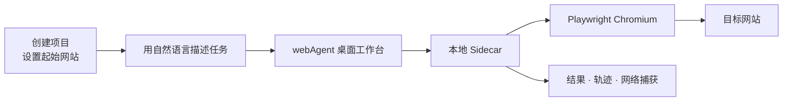

<div align="center">

# webAgent

### 让网页任务从一句话开始，落到可追溯的结果

面向真实网站操作的本地桌面 Agent。创建项目、描述目标，webAgent 会在本地浏览器中完成网页探索，并把执行过程与结果留在你的工作区。

[▶ 观看产品演示](demo/demo.mp4)&nbsp;&nbsp;·&nbsp;&nbsp;[快速开始](#快速开始)&nbsp;&nbsp;·&nbsp;&nbsp;[批量任务](#批量任务)

</div>

---

## 它能帮你做什么

| | 能力 | 你会得到什么 |
| :-: | --- | --- |
| 🗂️ | 项目化工作区 | 为每个网站建立独立项目，从该项目的起始 URL 出发执行任务。 |
| 💬 | 自然语言任务 | 用日常语言描述目标，例如“帮我整理一份竞品分析”。 |
| 👀 | 可见的执行过程 | 在界面中查看当前步骤、模型思考耗时、任务状态和最终回答；需要时可主动停止。 |
| 📦 | 批量运行与产物留存 | 导入 JSON 任务文件，预检后批量执行，并保存结果、浏览轨迹、网络捕获和运行日志。 |
| 🔌 | 可配置的模型服务 | 在应用内添加 OpenAI 兼容的模型服务，测试连接后按名称用于任务执行。 |

## 工作方式



每次任务都在本地浏览器中执行。桌面工作台负责项目、模型服务和实时进度；本地 Sidecar 负责运行控制与产物管理；浏览器负责实际网页操作。

## 快速开始

以下步骤以 **Windows PowerShell** 的本地开发环境为例。首次启动前请准备好 Conda、Node.js（含 npm）和 Rust 工具链；项目的 Python 环境固定为 **3.12**。

在仓库根目录执行：

```powershell
# 1. 创建并进入 Python 环境（首次执行）
conda env create -f environment.yml
conda activate webAgent

# 2. 安装项目使用的 Chromium
python -m playwright install chromium

# 3. 让桌面端能够启动本仓库的 Python Sidecar
$env:PYTHONPATH = "$PWD\src"
$env:BROWSER_USE_SETUP_LOGGING = "false"

# 4. 安装桌面端依赖并启动应用
Set-Location desktop
npm install
npm run tauri dev
```

应用窗口打开并显示“后端已就绪”后，即可进入下一步配置。后续启动时，只需激活 `webAgent` 环境、设置上述两个环境变量，然后在 `desktop/` 目录运行 `npm run tauri dev`。

## 首次任务

1. 打开“设置 → 添加模型服务”，填写模型服务名称、Base URL、API Key、模型名和响应模式；先点击“测试连接”，再保存。
2. 回到首页，点击“创建项目”，填写项目名称和网站 URL。
3. 在输入框中写下任务，例如：`帮我整理这个网站的产品定位、目标用户和三个主要卖点。`
4. 提交后，在工作区查看每一步进度与最终回答；项目侧栏可打开历史记录。

> [!IMPORTANT]
> API Key 属于敏感信息。模型服务会写入本地 `config.json` 以便运行使用；提交代码前务必确认它没有被加入版本控制。若密钥曾被提交或暴露，请立即在服务商处撤销并更换。

## 批量任务

需要一次处理多项网页任务时，打开“设置 → 批量操作”，依次选择任务文件、结果输出目录和已保存的模型服务，然后先执行“预检任务”。预检通过后再开始运行。

任务文件使用 JSON 或 JSONL；单个 JSON 任务的最小结构如下：

```json
[
  {
    "task_idx": 0,
    "task_id": "product-positioning",
    "website": "https://example.com",
    "task": "总结这个网站的产品定位和主要卖点。"
  }
]
```

每个任务会生成独立目录，包含 `result.json`、`trajectory/`、`trajectory_visual/`、`capture.json` 和日志等可复查产物。

## 命令行校验

桌面端之外，也可以先在命令行校验任务文件格式；该命令不会打开浏览器，也不需要模型凭据：

```powershell
conda activate webAgent
$env:PYTHONPATH = "$PWD\src"
$env:BROWSER_USE_SETUP_LOGGING = "false"

python -m browser_use.webretriever --input .\tasks.json --validate-only
```

运行器的完整参数可通过 `python -m browser_use.webretriever --help` 查看。

## 文档与开发

| 主题 | 入口 |
| --- | --- |
| 桌面端运行、Sidecar 与发布流程 | [桌面运行时说明](docs/desktop-runtime.md) |
| 本地控制面 API | [OpenAPI 定义](openapi.yaml) |
| 执行协议与领域术语 | [CONTEXT.md](CONTEXT.md) |
| Python / 桌面端测试 | `pytest tests` / `cd desktop; npm test` |

## 贡献

欢迎提交 Issue 和 Pull Request。提交前请保持改动聚焦，并至少运行与改动范围对应的测试。

## 许可证

本项目采用 [MIT License](LICENSE)。
