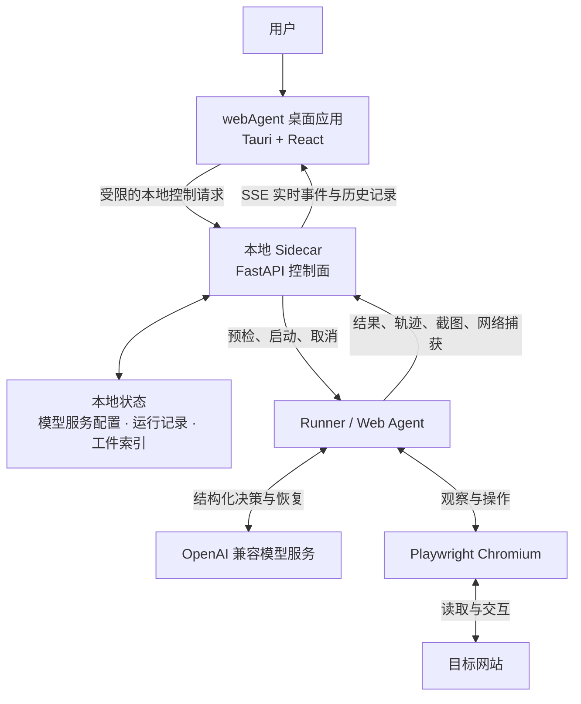

<div align="center">

# webAgent

### 让网页任务从一句话开始，落到可追溯的结果

面向真实网站操作的本地桌面 Agent。创建项目、描述目标，webAgent 会在本地浏览器中完成网页探索，并把执行过程与结果留在你的工作区。

[⬇️ 下载最新版](https://github.com/locip123/WebAgent/releases/latest)&nbsp;&nbsp;·&nbsp;&nbsp;[▶ 观看产品演示](https://locip123.github.io/WebAgent/)&nbsp;&nbsp;·&nbsp;&nbsp;[快速开始](#快速开始)&nbsp;&nbsp;·&nbsp;&nbsp;[批量任务](#批量任务)

</div>

---

## 它能帮你做什么

| | 能力 | 你会得到什么 |
| :-: | --- | --- |
| 🗂️ | 项目化工作区 | 为每个网站建立独立项目，从该项目的起始 URL 出发执行任务。 |
| 💬 | 自然语言任务 | 用日常语言描述目标，例如“帮我整理一份竞品分析”。 |
| 👀 | 可见的执行过程 | 在界面中查看当前步骤、模型思考耗时、任务状态和最终回答；需要时可主动停止。 |
| 📦 | 批量运行与产物留存 | 导入 JSON 任务文件，预检后批量执行，并保存结果、浏览轨迹、网络捕获和运行日志。 |
| 🔌 | 可配置的模型服务 | 在应用内添加 OpenAI 兼容的模型服务，测试连接后作为本地 Agent 的可用模型。 |

## Agent 架构



webAgent 的每次任务都在你的设备上运行，模型服务只负责推理和决策，网页操作由本地 Chromium 完成。各层职责如下：

| 层级 | 负责什么 |
| --- | --- |
| 桌面应用 | 管理项目、接收自然语言任务、配置模型服务，并显示思考耗时、执行步骤、最终回答和历史记录。 |
| 本地 Sidecar | 仅在本机回环地址提供控制接口；保存运行状态，预检任务，协调启动与停止，并把实时事件发送给桌面应用。一次只能有一个活动任务，避免浏览器操作互相干扰。 |
| Runner / Web Agent | 将任务转换为可执行流程：先整理并审查任务要求，再根据页面观察向模型请求下一步的结构化决策；执行器登记可追溯证据，并在结束前独立校验答案是否满足要求。 |
| 模型服务 | 通过你在应用中保存的 OpenAI 兼容接口提供推理。多个已配置服务可作为候选，运行时会优先选择可用且负载较低的服务，并在故障时尝试其他服务。 |
| 本地浏览器与工件 | Playwright 驱动本地 Chromium 访问目标网站。每次运行都会保留结果、浏览轨迹、可视化轨迹、网络捕获和日志，便于复查。 |

模型密钥只保存在本地模型服务配置中，不会出现在任务输入、运行事件或模型服务列表的响应里。请像保管密码一样保管设备和 API Key。

## 下载安装

前往 [Releases](https://github.com/locip123/WebAgent/releases/latest) 下载与你的系统匹配的安装包。发行包已内置 Sidecar 和 Chromium，普通用户不需要安装 Python、Conda 或 Node.js。

| 系统 | 选择的文件 | 安装方式 |
| --- | --- | --- |
| Windows 10 / 11 x64 | `.exe` 或 `.msi` | 双击安装。若出现 SmartScreen 提示，请确认下载来源为本仓库的 Release。 |
| Ubuntu / Debian x64 | `.deb` | 在下载目录运行 `sudo apt install ./WebAgent_*_linux-x64.deb`。 |
| 其他常见 Linux x64 发行版 | `.AppImage` | 运行 `chmod +x WebAgent_*_linux-x64.AppImage`，再双击或执行该文件。 |
| macOS（Intel） | `macos-x64.dmg` | 打开 DMG 后，将 WebAgent 拖入“应用程序”。 |
| macOS（Apple Silicon） | `macos-arm64.dmg` | 打开 DMG 后，将 WebAgent 拖入“应用程序”。 |

> [!NOTE]
> 当前 Windows 与 macOS 安装包未配置代码签名；Windows 可能显示 SmartScreen 提示，macOS 可能要求在“隐私与安全性”中确认打开。请只从本仓库的 Release 下载。

安装后，从系统的应用程序列表启动 **WebRetriever**。首次运行可能需要联网下载 tiktoken 词表；实际执行网页任务还需要有效的模型服务配置。

## 快速开始

以下步骤仅面向需要从源码运行或参与开发的用户；如只需使用应用，请直接按照上方“下载安装”操作。以 **Windows PowerShell** 的本地开发环境为例，首次启动前请准备好 Conda、Node.js（含 npm）和 Rust 工具链；项目的 Python 环境固定为 **3.12**。

在仓库根目录执行：

```powershell
# 1. 创建并进入 Python 环境（首次执行）
conda env create -f environment.yml
conda activate webAgent

# 2. 安装项目使用的 Chromium
python -m playwright install chromium

# 3. 让桌面端能够启动本仓库的 Python Sidecar
$env:PYTHONPATH = "$PWD\src"
$env:BROWSER_USE_SETUP_LOGGING = "false"

# 4. 安装桌面端依赖并启动应用
Set-Location desktop
npm install
npm run tauri dev
```

应用窗口打开并显示“后端已就绪”后，即可进入下一步配置。后续启动时，只需激活 `webAgent` 环境、设置上述两个环境变量，然后在 `desktop/` 目录运行 `npm run tauri dev`。

## 安装后：配置模型并完成首次任务

安装包已经包含运行任务所需的 Sidecar 和 Chromium；首次打开应用、看到“后端已就绪”后，只需配置一个可用的模型服务即可开始。请先从模型服务商处准备 API Key、模型标识和 API Base URL。

### 1. 添加并测试模型服务

打开 **设置 → 添加模型服务**，填写以下信息。建议先点击“测试连接”，确认通过后再点击“添加服务”；已保存的服务也可以随时再次测试。

| 字段 | 填写方式 |
| --- | --- |
| 模型服务名称 | 给这条连接取一个唯一、易识别的名称，例如 `openai-primary` 或 `company-gateway`。 |
| Base URL | 填服务商提供的 API 根地址，例如 `https://api.example.com/v1`。不要在末尾附加 `/responses` 或 `/chat/completions`，应用会按响应模式补上对应路径。 |
| API Key | 填服务商签发的密钥。输入框会隐藏内容，保存后列表也不会回显密钥。 |
| 模型 | 填服务商要求的精确模型 ID，例如 `gpt-4.1-mini`。 |
| 响应模式 | 服务支持 OpenAI **Responses API** 时选择 `Responses`；服务提供传统的 `/chat/completions` 接口时选择 `Chat Completions`。必须与服务商文档一致。 |

连接测试会向所选接口发起一条最小请求。若失败，优先检查 Base URL、模型 ID、API Key 权限和响应模式；不要把完整 API Key 粘贴到截图、Issue 或日志中。

### 2. 创建项目并提交任务

1. 回到首页，点击“创建项目”，填写项目名称和要访问的网站 URL。
2. 在项目的输入框用自然语言描述目标，例如：`帮我整理这个网站的产品定位、目标用户和三个主要卖点。`
3. 点击提交。桌面应用会把任务交给本地 Sidecar，随后打开本地 Chromium 执行网页操作；刚保存的模型服务会自动作为默认本地配置的一部分参与任务，无需在首页重复填写密钥。
4. 在工作区查看每一步进度、模型思考耗时和最终回答；需要中止时点击“停止任务”。项目侧栏的“历史”可重新查看以往任务。

需要一次执行多个 JSON / JSONL 任务时，进入 **设置 → 批量操作**，选择任务文件与结果输出目录，模型配置填写 `local-default`，先执行“预检任务”，通过后再开始运行。

> [!IMPORTANT]
> API Key 属于敏感信息。模型服务会写入本地 `config.json` 以便运行使用；提交代码前务必确认它没有被加入版本控制。若密钥曾被提交或暴露，请立即在服务商处撤销并更换。

## 批量任务

需要一次处理多项网页任务时，打开“设置 → 批量操作”，依次选择任务文件、结果输出目录和已保存的模型服务，然后先执行“预检任务”。预检通过后再开始运行。

任务文件使用 JSON 或 JSONL；单个 JSON 任务的最小结构如下：

```json
[
  {
    "task_idx": 0,
    "task_id": "product-positioning",
    "website": "https://example.com",
    "task": "总结这个网站的产品定位和主要卖点。"
  }
]
```

每个任务会生成独立目录，包含 `result.json`、`trajectory/`、`trajectory_visual/`、`capture.json` 和日志等可复查产物。

## 命令行校验

桌面端之外，也可以先在命令行校验任务文件格式；该命令不会打开浏览器，也不需要模型凭据：

```powershell
conda activate webAgent
$env:PYTHONPATH = "$PWD\src"
$env:BROWSER_USE_SETUP_LOGGING = "false"

python -m browser_use.webretriever --input .\tasks.json --validate-only
```

运行器的完整参数可通过 `python -m browser_use.webretriever --help` 查看。

## 文档与开发

| 主题 | 入口 |
| --- | --- |
| 桌面端运行、Sidecar 与发布流程 | [桌面运行时说明](docs/desktop-runtime.md) |
| 本地控制面 API | [OpenAPI 定义](openapi.yaml) |
| 执行协议与领域术语 | [CONTEXT.md](CONTEXT.md) |
| Python / 桌面端测试 | `pytest tests` / `cd desktop; npm test` |

## 贡献

欢迎提交 Issue 和 Pull Request。提交前请保持改动聚焦，并至少运行与改动范围对应的测试。

## 许可证

本项目采用 [MIT License](LICENSE)。
